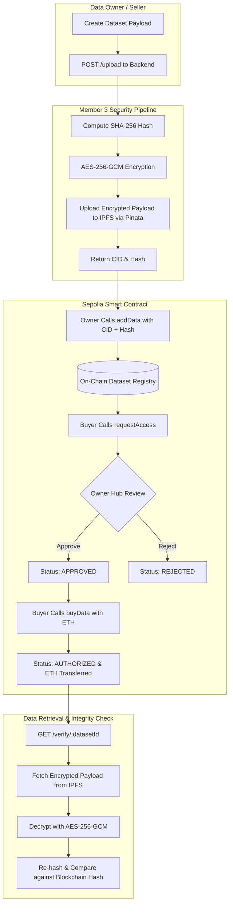

# DataChain — Decentralized Blockchain Data Marketplace

DataChain is a decentralized, peer-to-peer data marketplace built on Ethereum Sepolia testnet, IPFS, and a Node.js/MongoDB backend. It enables data providers (owners/sellers) to list, encrypt, and monetize datasets while ensuring strict cryptographic access control, transparent pricing, zero intermediaries, and verifiable data integrity.

---

## 1. Problem Statement

In conventional data trading platforms:
- **Centralized Intermediaries**: Brokers take substantial revenue cuts and maintain single points of failure.
- **Unauthorized Data Redistribution**: Buyers can easily leak or resell purchased datasets without accountability.
- **Tampering & Integrity Loss**: Data consumers have no decentralized method to verify that received files match the authentic original data.
- **Lack of Trustless Settlement**: Access control and payments rely on centralized clearinghouses rather than verifiable smart contracts.

---

## 2. Objectives

1. **Decentralized Access Management**: Implement a state-machine smart contract on Sepolia supporting `NONE` $\rightarrow$ `PENDING` $\rightarrow$ `APPROVED`/`REJECTED` $\rightarrow$ `AUTHORIZED` access lifecycles.
2. **End-to-End Cryptographic Security**: Secure dataset payloads with AES-256-GCM encryption before offloading to IPFS.
3. **Decentralized Integrity Verification**: Register immutable SHA-256 hashes on the blockchain to enable trustless data verification.
4. **Trustless Payments**: Direct peer-to-peer ETH payments from buyers to sellers upon smart contract authorization.
5. **Unified Modern Interface**: Provide a responsive, multi-page frontend for dataset exploration, listing, company verification, owner approval workflows, and transaction inspection.

---

## 3. Technology Stack

- **Smart Contract Layer**: Solidity (`^0.8.28`), Hardhat, Ethers.js v6
- **Blockchain Network**: Ethereum Sepolia Testnet (Chain ID: `11155111`, Hex: `0xaa36a7`)
- **Deployed Contract**: `0x02018B847dA98a987EE59d7F235b2c690085F044`
- **Decentralized Storage**: Pinata / IPFS (InterPlanetary File System)
- **Encryption & Hashing**: AES-256-GCM (Authenticated Encryption), SHA-256
- **Backend**: Node.js, Express.js, Mongoose (MongoDB 8+), Express-Validator
- **Frontend**: Vanilla JavaScript (ES6+), Ethers.js UMD v6, CSS3 (Mobile-first, responsive sage/glassmorphism design system)
- **Wallet Provider**: MetaMask Browser Extension

---

## 4. System Architecture & Workflow



---

## 5. Application Structure

```
data_marketplace/
├── contracts/
│   └── DataMarketplace.sol        # Sepolia smart contract
├── test/
│   └── DataMarketplace.test.js    # Hardhat contract unit tests
├── backend/
│   ├── config/
│   │   └── db.js                  # MongoDB Mongoose connection
│   ├── controllers/
│   │   └── dataController.js      # Upload & verification controller
│   ├── models/
│   │   ├── AccessRequest.js       # Company access request schema
│   │   ├── Company.js             # Company registration schema
│   │   ├── Data.js                # Dataset metadata schema
│   │   └── Transaction.js         # Purchase transaction schema
│   ├── Routes/
│   │   ├── accessRequestRoutes.js # Access management endpoints
│   │   ├── companyRoutes.js       # Company verification endpoints
│   │   ├── Dataroutes.js          # Dataset metadata endpoints
│   │   ├── member3Routes.js       # IPFS upload & verify endpoints
│   │   └── Transactionroutes.js   # Transaction history endpoints
│   ├── services/
│   │   ├── blockchainService.js   # Backend contract interaction
│   │   ├── encryptionServices.js  # AES-256-GCM & SHA-256 utilities
│   │   └── ipfsService.js         # Pinata IPFS integration
│   └── server.js                  # Express API server (Port 3000)
├── frontend/
│   ├── access.html                # Company registration & verification
│   ├── addData.html               # Add dataset with IPFS + contract publish
│   ├── app.js                     # Shared wallet, contract ABI, and UI helpers
│   ├── dataset.html               # Dataset details, request access & pay
│   ├── index.html                 # Landing page & platform statistics
│   ├── listings.html              # Portfolio of datasets owned by wallet
│   ├── marketplace.html           # Browse & filter all on-chain datasets
│   ├── owner.html                 # Owner dashboard (approve / reject requests)
│   ├── profile.html               # Profile, connected wallet & network status
│   ├── style.css                  # Responsive design tokens & UI components
│   └── transactions.html          # Transaction history with Etherscan links
├── hardhat.config.js              # Hardhat configuration (Solidity 0.8.28)
├── package.json                   # Root dependencies & test scripts
└── README.md                      # Project documentation
```

---

## 6. Installation & Setup

### Prerequisites
- Node.js (v18 or higher)
- MongoDB (running locally on `mongodb://127.0.0.1:27017` or MongoDB Atlas URI)
- MetaMask extension installed in browser
- Sepolia testnet ETH in your wallet (from public Sepolia faucets)

### 1. Clone Repository & Install Dependencies
```bash
git clone https://github.com/sunerikulkarni/blockchain-data-marketplace.git
cd blockchain-data-marketplace

# Install root & Hardhat dependencies
npm install

# Install backend dependencies
cd backend
npm install
cd ..
```

### 2. Configure Environment Variables
Create a `backend/.env` file in the `backend/` directory (see `backend/.env.example`):
```env
PORT=3000
MONGO_URI=mongodb://127.0.0.1:27017/datachain
SEPOLIA_RPC_URL=https://rpc.sepolia.org
CONTRACT_ADDRESS=0x02018B847dA98a987EE59d7F235b2c690085F044
ADMIN_WALLET=0xYourAdminWalletAddress
ENCRYPTION_KEY=your-32-byte-hex-encryption-key
PINATA_JWT=your-pinata-jwt-token
PINATA_GATEWAY=gateway.pinata.cloud
```

> **SECURITY NOTE**: Never commit `.env` files, private keys, or seed phrases to version control.

---

## 7. Running the Application

### 1. Start the Backend API (Port 3000)
```bash
cd backend
npm start
```
*API will run at `http://localhost:3000`.*

### 2. Start the Frontend Server (Port 5500)
In a separate terminal:
```bash
# Using Python
python -m http.server 5500 --directory frontend

# OR using Node http-server / npx
npx serve frontend -p 5500
```
*Open `http://localhost:5500` in your browser.*

---

## 8. Running Automated Tests

Run smart contract test suite via Hardhat:
```bash
npm test
```
*Executes all 13 unit tests covering deployment, dataset addition, access requests, owner approval/rejection, payment validation, and authorization states.*

---

## 9. Two-Wallet Demonstration Workflow

To demonstrate the full marketplace lifecycle:

| Step | Persona | Action | Expected Result |
| :--- | :--- | :--- | :--- |
| **1** | **Owner (Wallet A)** | Connect to `http://localhost:5500/addData.html` on Sepolia | Fills dataset details and uploads. Payload encrypted & sent to IPFS. MetaMask confirms `addData()`. |
| **2** | **Owner (Wallet A)** | Open `http://localhost:5500/listings.html` or `owner.html` | Newly published dataset appears with price and metadata. |
| **3** | **Buyer (Wallet B)** | Switch MetaMask to Wallet B, open `http://localhost:5500/marketplace.html` | Browses marketplace, selects dataset, clicks **View & Buy**. |
| **4** | **Buyer (Wallet B)** | In `dataset.html?id=<ID>`, click **Request Access** | Submits `requestAccess(id)` on-chain. Status changes to **PENDING**. |
| **5** | **Owner (Wallet A)** | Switch MetaMask to Wallet A, open `http://localhost:5500/owner.html` | Sees Wallet B's pending request. Clicks **✓ Approve Access** and confirms in MetaMask. |
| **6** | **Buyer (Wallet B)** | Switch back to Wallet B, refresh `dataset.html?id=<ID>` | Status displays **APPROVED**. The **Pay with MetaMask** button is now enabled. |
| **7** | **Buyer (Wallet B)** | Clicks **Pay with MetaMask** | Sends exact dataset price (e.g. 0.001 ETH) to contract. Payment confirmed on Sepolia. |
| **8** | **Buyer (Wallet B)** | Status updates to **AUTHORIZED** | Buyer has permanent verified access. Payment credited directly to Seller. |
| **9** | **Rejection Test** | Wallet B requests access to Dataset #2 $\rightarrow$ Wallet A clicks **✕ Reject Request** | On-chain status updates to **REJECTED**. |

---

## 10. Project Limitations

1. **Testnet Gas Dependency**: Every on-chain operation requires Sepolia testnet ETH for gas fees.
2. **IPFS Pinning Quotas**: Pinata upload requires valid API credentials in `.env`; local fallback references are used when Pinata is offline.
3. **MetaMask Confirmation**: All state-changing transactions require explicit user approval in the MetaMask extension window.

---

## 11. Authors & Credits

- **Project**: DataChain — Blockchain Data Marketplace
- **Academic Year**: Final Year B.Tech Major Project
- **Branch**: `blockchain`
